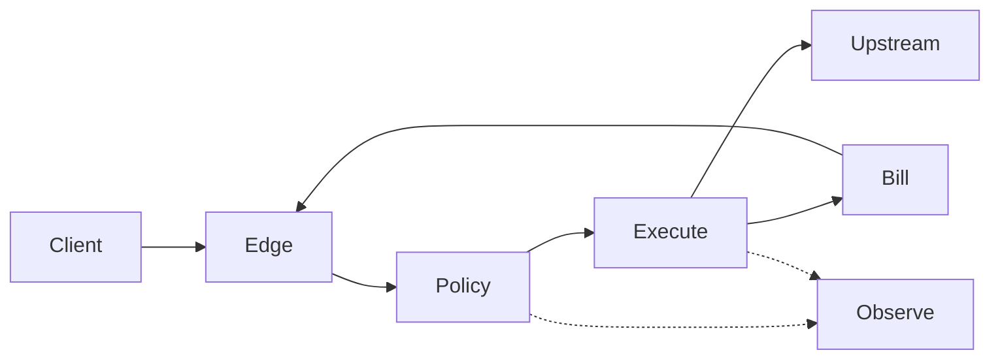
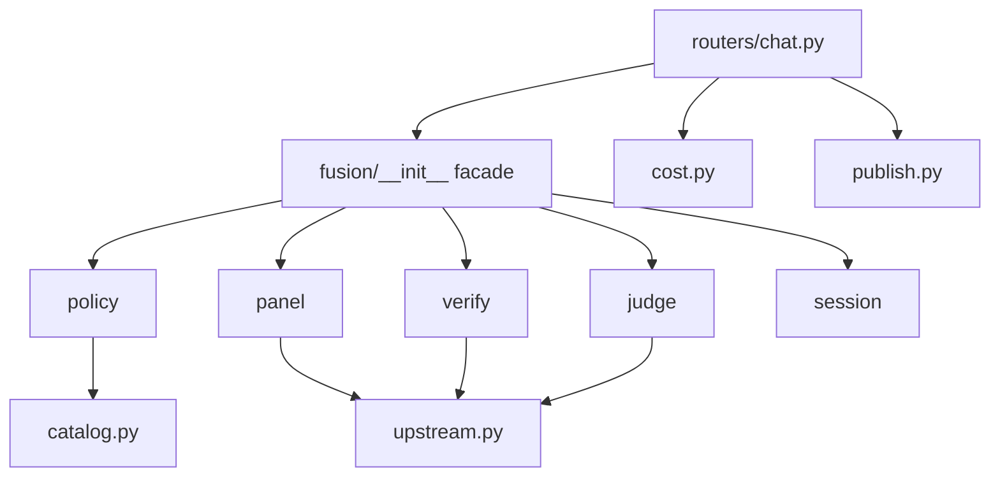
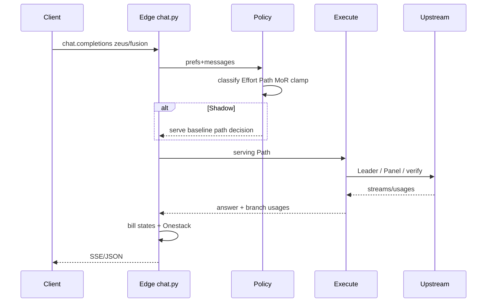

# Architecture Spine — Zeus Fusion

## Design Paradigm

**OpenAI-compatible Gateway + Path Orchestrator** (layered pipeline).

| Layer | Responsibility | Lives in |
| --- | --- | --- |
| Edge | Auth, balance, alias normalize, SSE wire | `routers/chat.py` |
| Policy | Classify, Effort bump, Path table, MoR tip, mode clamp, flags/shadow | `fusion/policy.py` |
| Execute | FAST/CASCADE/RACE/FULL, Brief, verify, Judge | `fusion/panel.py`, `verify.py`, `judge.py` |
| Bill | Billable states, UsageLog, Onestack enrich | `routers/chat.py` + `cost.py` (orchestrated by fusion result) |
| Observe | trace_id, metrics, eval hooks | `fusion/metrics.py` + logging |



## Invariants & Rules

### AD-1 — Gateway + Path Orchestrator paradigm `[ADOPTED]`

- **Binds:** all fusion request handling
- **Prevents:** parallel “second fusion” stacks in studio/TG with divergent Path semantics
- **Rule:** Every `zeus/fusion*` completion enters the same Policy→Execute→Bill pipeline (TG/site may call `iter_fusion`/`run_fusion` but must not fork Path rules).

### AD-2 — Stable public model id + internal Path enum `[ADOPTED]`

- **Binds:** FR-1, FR-37, catalog
- **Prevents:** client-facing Path churn; alias/Path confusion
- **Rule:** Public id remains `zeus/fusion` (+ documented aliases). Serving Path ∈ {`FAST`,`CASCADE`,`RACE`,`FULL`} only in MVP Onestack. Legacy `fast`/`full` map per PRD FR-37 (`legacy_*` ≠ `forced_*`).

### AD-3 — Deterministic Path control flow `[ADOPTED]`

- **Binds:** FR-28, FR-3, FR-5, FR-4
- **Prevents:** two routers with opposite escalate rates
- **Rule:** Order is fixed: classify → Effort=`high` complexity +1 → policy first-match (Path Phase = **classify**; `design_lexicon` → plan override) → MoR local tip 0|1 step → Product Mode clamp. Sticky never feeds Path Phase.

### AD-4 — Context ownership (no ×3) `[ADOPTED]`

- **Binds:** FR-10, FR-22
- **Prevents:** satellites receiving full Cursor/skills dump
- **Rule:** Leader gets sanitized full client context; Satellites get Brief only (`last_assistant` + errors + goal). Anti-bloat sanitize stays before Execute.

### AD-5 — Early-exit & verify authority `[ADOPTED]`

- **Binds:** FR-8, FR-12, FR-31, FR-10
- **Prevents:** Leader self-score exits; Aspect skipped by clone-detect
- **Rule:** Early-exit only via Mini-Verifier, Aspect-Verifiers, or near-duplicate (τ). Aspects run **before** near-duplicate exit. Leader self-evaluation never gates stop.

### AD-6 — Fusion package boundaries

- **Binds:** backend structure, CE file ownership
- **Prevents:** god-module re-growth; routers importing upstream ad-hoc for fusion Paths
- **Rule:** New Path logic lands under `backend/app/fusion/` (`policy`, `panel`, `verify`, `judge`, `session`, `metrics`). `routers/chat.py` wires only. `fusion/*` must not import `routers.*`. Existing `fusion.py` may facade-reexport during migration.



### AD-7 — Sticky session ownership

- **Binds:** FR-16, FR-2
- **Prevents:** sticky Phase stealing Path from classify; missing session store
- **Rule:** Store keyed by `session_id` (`X-Zeus-Session-Id` / `zeus.session_id`): `{leader, stack, phase_meta, expires_at}`. Sticky updates Leader/stack (+ phase_meta); Path uses classify only. MVP store = SQLAlchemy/SQLite table (or equivalent durable row); Redis deferred.

### AD-8 — Honest billing & Onestack `[ADOPTED]`

- **Binds:** FR-19, FR-20, FR-14, FR-9
- **Prevents:** silent unpaid branches; Path metrics on policy-not-final
- **Rule:** Every upstream/control call carries billable state ∈ {`completed`,`partial_stream`,`cancelled_no_tokens`,`cancelled_with_usage`}. Onestack `path` = **final** execution Path; include `policy_path`, optional `escalate_from`, closed `routed_by` set from PRD. Soft-Stop selection lives in Execute (`panel.py`) before Bill sees the result. Bill reads only `FusionResult` (AD-14), never invents Path from token heuristics.

### AD-9 — Shadow / Canary / Kill flags

- **Binds:** FR-18, §6.4, SM-*
- **Prevents:** ungateable Path flips; incomparable Shadow baselines; Edge inventing Path under Shadow
- **Rule:** Global + account-cohort flags. Policy always computes `candidate_path` + `routed_by`. Shadow: log candidate vs `baseline_id`; **serving** Path = frozen baseline decision (not Edge reinterpretation). `baseline_id` = immutable hash(policy+lexicon_v1+panel constants); first canary baselines legacy 1↔3. Kill-Switch clamps to FAST. After Policy returns serving Path, Execute may only append escalate codes (`cascade_escalate_*`, `race_*`) — never invent a new policy row.

### AD-10 — Dependency direction `[ADOPTED]`

- **Binds:** all backend fusion code
- **Prevents:** circular imports; publish/policy entanglement
- **Rule:** `routers → fusion → {upstream, catalog, cost helpers}`; `publish` only post-answer from chat wire. Policy must not call Judge; Judge must not choose Path.

### AD-11 — Prefs & request precedence `[ADOPTED]`

- **Binds:** FR-2, FR-3, FR-23
- **Prevents:** TG prefs fighting request `zeus.*`
- **Rule:** per-request `zeus.*` > `users.fusion_*` > product default. Product Mode clamps Path (`simple` ∈ {FAST,CASCADE} unless forced/legacy full).

### AD-12 — Runtime mechanism presence `[ADOPTED]`

- **Binds:** FR-29, FR-15, FR-17
- **Prevents:** Paths without budgets shipping “green”
- **Rule:** Each request has global timeout, concurrency caps (Panel/RACE), retry/backoff, disaster structured error, thinking keepalive, rate limits, overflow/long-context Leader selection. Numbers owned by ops/config; missing mechanism = fail Done.

### AD-13 — Eval & lexicon freeze gate

- **Binds:** FR-25, FR-28 fixtures, §6.4
- **Prevents:** silent Path distribution shifts; theater fixtures
- **Rule:** Canary→100% requires Eval fixtures F1–F17 / I1–I3 / R1–R2 + pass oracle. `lexicon_v1` id embedded in `baseline_id`; lexicon growth = new id + Eval.

### AD-14 — FusionResult handoff contract

- **Binds:** Execute → Bill/Edge; FR-19/20
- **Prevents:** clashing Onestack/UsageLog shapes between panel and chat bill
- **Rule:** Execute returns a single `FusionResult` (name stable) with at least: `path`, `policy_path`, `escalate_from?`, `routed_by`, `phase`, `complexity`, `leader`, `branches[]` (`model`, `role`, `usage`, `billable_state`), `answer`, `trace_id`. Bill/Onestack builders consume only this type. No parallel legacy `agents`-only charge path for new Path code.

### AD-15 — Canonical internal Path taxonomy

- **Binds:** policy, panel, facade, TG/tests migration
- **Prevents:** dual `fast|full` vs Path enums inside fusion
- **Rule:** Inside `fusion/*`, serving decision is Path enum only. Legacy stack size `fast|full` may exist only at Edge alias normalize / Shadow baseline adapter, then map 1:1 into Path (`fast`→`FAST`, `full`→`FULL`) before Policy/Execute. New code must not return `fast|full` as the serving mode.

### AD-16 — Single Leader mutator

- **Binds:** FR-16, FR-15, FR-29 overflow, session
- **Prevents:** sticky vs overflow dual-owners of Leader
- **Rule:** Runtime Leader for a request is chosen once in Policy/Execute startup (`pick_leader`: sticky hint → health → overflow/long-context). Sticky store is written **only at request end** with the Leader that actually produced the final answer (or Soft-Stop partial). Mid-request overflow swap updates the in-flight Leader and is what gets persisted — session.py does not overwrite from a stale pre-overflow pick.

### AD-17 — Scrub ownership

- **Binds:** FR-21
- **Prevents:** satellites scrubbed differently than Leader; double/missing scrub
- **Rule:** Secret/PII scrub runs once on the Edge→Policy boundary (shared helper). Execute must not re-scrub inconsistently; Brief is derived from already-scrubbed Leader context.

### AD-18 — Deploy / ops envelope

- **Binds:** production rollout
- **Prevents:** silent ops dimension; CE inventing infra
- **Rule:** MVP deploy = existing ZeusCode API process (uvicorn, single-node). Sticky on SQLite/SQLAlchemy. Multi-node sticky = Deferred Redis. Budgets/flags via Settings or DB flags table. Eval artifacts in repo/CI. No new cloud provider required.

## Consistency Conventions

| Concern | Convention |
| --- | --- |
| Naming Paths | `FAST` \| `CASCADE` \| `RACE` \| `FULL` (uppercase in Onestack) |
| Naming phases | lowercase PRD Phase enum |
| `routed_by` | Closed PRD set; `legacy_*` ≠ `forced_*` |
| Errors | Structured JSON error body on disaster; never empty 200 with blank content when fallback existed |
| Logging | `trace_id` on every fusion request; agent latencies in Onestack |
| Config | Budgets/flags in Settings or flag table; panel model lists may stay code constants until extracted |
| Auth | Existing API-key path; fusion adds no auth scheme |
| Dates/ids | ISO timestamps in logs; `session_id` opaque string ≤128 chars `[ASSUMPTION]` |

## Stack

| Name | Version |
| --- | --- |
| Python | 3.10+ `[ADOPTED: local/dev 3.10.11; pin deploy ≥3.10]` |
| FastAPI | ≥0.115.0 |
| Uvicorn | ≥0.32.0 |
| httpx | ≥0.27.0 |
| SQLAlchemy (async) | ≥2.0.36 |
| aiosqlite | ≥0.20.0 |
| pydantic-settings | ≥2.0.0 |
| aiogram | ≥3.13.0 (TG prefs surface) |

## Structural Seed

```text
backend/app/
  routers/chat.py          # Edge wire, bill, SSE, publish hook
  fusion/
    __init__.py            # facade: iter_fusion, run_fusion
    policy.py              # classify, Effort, Path table, MoR, clamps, lexicon
    panel.py               # FAST/CASCADE/RACE/FULL execution, Brief
    verify.py              # Mini-Verifier + Aspect-Verifiers
    judge.py               # Structured Judge + rank-then-fuse
    session.py             # sticky store
    metrics.py             # routed_by histograms helpers / shadow compare
  upstream.py              # provider adapters [ADOPTED]
  catalog.py / cost.py / publish.py / config.py
```



## Capability → Architecture Map

| Capability / FR | Lives in | Governed by |
| --- | --- | --- |
| FR-1/37 aliases | catalog + chat normalize + policy | AD-2 |
| FR-4/5 classify+Effort | fusion/policy.py | AD-3 |
| FR-28 Path+MoR+lexicon | fusion/policy.py | AD-3, AD-13 |
| FR-3/23 mode prefs | users.fusion_* + policy clamp | AD-11 |
| FR-7..11 Paths | fusion/panel.py | AD-1, AD-3 |
| FR-8/12/31 verify | fusion/verify.py | AD-5 |
| FR-10/13 Judge | fusion/judge.py | AD-5, AD-4 |
| FR-16 sticky | fusion/session.py | AD-7 |
| FR-14 Soft-Stop | fusion/panel.py → FusionResult | AD-8, AD-14 |
| FR-19/20 billing+Onestack | chat bill consumes FusionResult | AD-8, AD-14 |
| FR-21 scrub | shared helper at Edge→Policy | AD-17 |
| FR-18/25 flags+eval | flags + eval suite scripts | AD-9, AD-13 |
| FR-26 publish | publish.py post-answer | AD-10 |
| FR-29 runtime | policy/panel + Settings | AD-12 |
| FR-32 prompt adapt | panel/policy prompt layer | AD-4 |
| FR-34 custom panel | policy resolve_panel | AD-11, AD-15 |
| FR-24 feedback log | UsageLog / feedback table (Edge) | Deferred detail |
| FR-27 tools v2 | Deferred | Deferred |
| Deploy/ops | existing VPS uvicorn | AD-18 |

## Deferred

- Redis sticky / distributed session — revisit at multi-node pressure (AD-18)
- True upstream token streaming (vs post-hoc SSE) — separate epic; keepalive still required
- Panel/judge model lists moved to Settings/DB — after Path policy stable
- Elo writeback affecting Leader — v1.x (PRD); MVP log-only schema in Edge
- DUAL / Tradeoff / Presets — v1.x
- TOOL-FULL / agent tools path — v2 FR-27
- Numeric timeout/concurrency values — ops before canary (presence = AD-12)
- Full MoR vote engine — out; local tip only
- FR-24 feedback storage shape — CE story; must not affect Path
