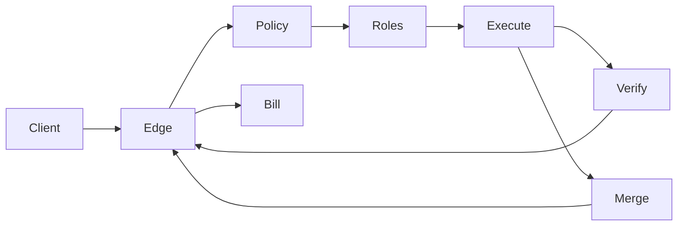
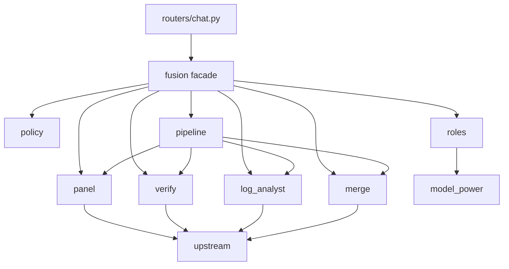
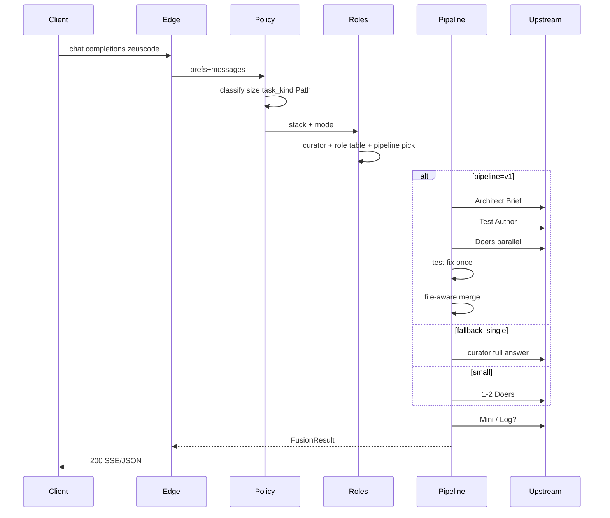

# Architecture Spine — ZeusCode Role Routing

## Design Paradigm

**OpenAI-compatible Gateway + Role Pipeline Orchestrator** (layered pipeline over Fusion Path).

| Layer | Responsibility | Lives in |
| --- | --- | --- |
| Edge | Auth, balance, alias→`zeuscode`, SSE/JSON wire, bill | `routers/chat.py` |
| Policy | Scrub, classify size/task_kind, Path lattice (internal), mode clamp, kill | `fusion/policy.py` |
| Roles | Role→Model table, score gates, curator pick, stack resolve | `fusion/roles.py` |
| Execute | `pipeline` ∈ {`small`,`v1`,`fallback_single`}, Path executors | `fusion/pipeline.py`, `panel.py` |
| Verify | Mini-Verifier, Log Analyst, Gate, Soft-Stop pick | `fusion/verify.py`, `log_analyst.py` |
| Merge | File-aware assemble; conflict → strong | `fusion/merge.py` |
| Bill / Observe | FusionResult → UsageLog/Onestack; trace | chat + `metrics.py` |



## Inherited Invariants

Parent: `architecture-ZeusCode-2026-07-22` (Fusion Path spine). Binding unless a local AD explicitly supersedes the public surface.

| Inherited | From parent | Binds here |
| --- | --- | --- |
| AD-1 Gateway+Path Orchestrator layers | parent | Same Edge→Policy→Execute→Bill; Role Pipeline sits inside Execute/Roles |
| AD-3 Deterministic Path control flow | parent | Path Phase = classify; sticky never feeds Path; Effort+1 / MoR tip / mode clamp order |
| AD-4 Context ownership (no ×3) | parent | Leader/full scrubbed ctx; satellites/doers get Brief (+ own chunk), not peer dumps |
| AD-5 Early-exit & verify authority | parent | Gate/Mini authority; Doer self-score never forces GREEN |
| AD-6 Fusion package boundaries | parent | New logic under `fusion/`; `routers` wire-only; no `fusion→routers` |
| AD-7 Sticky session ownership | parent | Sticky = leader/stack; not Path; not pipeline mode |
| AD-8 Honest billing & Onestack | parent | Billable states; Onestack path=final; Soft-Stop in Execute before Bill |
| AD-9 Shadow/Canary/Kill | parent | Kill → FAST + **no Pipeline v1** (NFR-5) |
| AD-10 Dependency direction | parent | `routers → fusion → upstream/catalog/cost`; Policy ≠ Judge Path owner |
| AD-11 Prefs precedence | parent | `zeus.*` > `users.fusion_*` > default; Product Mode clamps Path + pipeline eligibility |
| AD-12 Runtime budgets present | parent | Global timeout, concurrency for parallel doers, retry, keepalive, rate, overflow |
| AD-13 Eval/lexicon freeze | parent | Canary gated by fixtures; lexicon id in baseline |
| AD-14 FusionResult handoff | parent | Single handoff type Edge/Bill; extended fields in AD-28 |
| AD-15 Internal Path taxonomy | parent | Inside `fusion/*` Path enum only; RACE not serving target for Role Routing large v1 |
| AD-16 Single Leader mutator | parent | One runtime leader/curator pick path; sticky write at end |
| AD-17 Scrub once Edge→Policy | parent | Brief/log briefs from scrubbed context |
| AD-18 Deploy ops envelope | parent | Existing uvicorn + SQLite; no new cloud |

**Conflict (surfaced):** Parent AD-2 public id `zeus/fusion` — **superseded for client narrative** by AD-19 (`zeuscode`). Aliases remain. Path UX buttons remain forbidden (PRD invariant).

## Invariants & Rules

### AD-19 — Public model id `zeuscode` `[ADOPTED]`

- **Binds:** FR-4, FR-17, catalog, Edge normalize
- **Prevents:** client-facing mode ids (`zeuscode-simple|power|custom`); narrative drift to Path pickers
- **Rule:** Public completion id = `zeuscode`. Legacy `zeus/fusion*` resolve. Client pickers and TG guides never present mode-suffixed Zeus ids. Modes exist only in TG «Модели».

### AD-20 — Pipeline mode enum (product cost modes) `[ADOPTED]`

- **Binds:** FR-18, FR-12, Path lattice K, Onestack
- **Prevents:** Path buttons as product UX; silent RACE-as-large default; dual writers of `pipeline`
- **Rule:** Every `zeuscode` request sets `pipeline` ∈ {`small`, `v1`, `fallback_single`}. **`pipeline.py` is the sole final writer** of `FusionResult.pipeline` / Onestack `pipeline` (may degrade `v1`→`fallback_single` on Architect fail). `roles.py` may propose an intent; it must not stamp the result. Internal Path still ∈ {`FAST`,`CASCADE`,`RACE`,`FULL`} per AD-15 + addendum K — Onestack keeps **both** `path` (final Path, AD-8) and `pipeline` (cost mode). Role Routing v1 **must not** choose RACE as the target serving path for large. No new UI controls for Path/cascade/race/усилить.

### AD-21 — Role≠model + curator ownership `[ADOPTED]`

- **Binds:** FR-1, FR-2, FR-4, custom stack
- **Prevents:** auto-injecting models into custom; two owners of “who answers”
- **Rule:** Assignment is two-step: `task_kind → roles` then `role × product_mode → model` from **user-chosen** stack (preset or custom ≤3), then score gates. **Curator** = `argmax power_score(stack)`. Custom: never add models the user did not pick. `TEST_AUTHOR_MIN` (default 950) gates Architect / Test Author / conflict-merge strong call.

### AD-22 — Pipeline v1 trigger (hard) `[ADOPTED]`

- **Binds:** FR-18.1, NFR-8, SM-6, SM-9, FR-1
- **Prevents:** expensive multi-role default; cost-bomb on low-conf alone; divergent “2nd signal” parsers
- **Rule:** `pipeline=v1` **iff** `size=large` ∧ **second_signal** ∧ `mode ∈ {power,custom}` ∧ ∃ model in stack with `power_score ≥ TEST_AUTHOR_MIN`. **second_signal** (closed set, any one): architecture/migrate lexicon hit · multi-file edit intent · landing-from-scratch · explicit heavy request. `confidence < 0.6` alone may set `size=large` as risk label but is **not** second_signal. Else: `small` (incl. large without 2nd), or `fallback_single` when large+2nd but no ≥950. `simple` and kill-switch → never `v1`.

### AD-23 — fallback_single = curator full answer `[ADOPTED]`

- **Binds:** FR-18.8, FR-12, Decision A/2А
- **Prevents:** mid-parallel without curator; Brief-only stall when no ≥950
- **Rule:** On `fallback_single`, curator writes the **full answer in one call** (no separate Architect Brief step) → Mini-Verifier → Log Analyst only if AD-27 allows → Escalate ≤2 on RED. Mid-parallel doers forbidden.

### AD-24 — Brief contract for Pipeline v1 `[ADOPTED]`

- **Binds:** FR-18.2–4, FR-13, AD-4
- **Prevents:** doers sharing peer code; Brief sprawl
- **Rule:** Architect (≥950) emits Brief with `components[]` length ≤ **3**; each `{id, role, goal, acceptance_one_liner, files_hint?}`. Doer input = Brief + own component + own contract tests. Peer doer outputs are invisible until Merge.

### AD-25 — Verify budget order (3А) `[ADOPTED]`

- **Binds:** FR-6, FR-7, FR-8, Soft-Stop D
- **Prevents:** infinite escalate; double-counting test-fix as escalate; Soft-Stop picking pre-merge fragments
- **Rule:** Order: (1) one Test Author RED→FIX→recheck cycle **does not** consume escalate budget; (2) then Escalate/`judge_fix` ≤ **2 global** per request; (3) Soft-Stop: HTTP **200**, non-empty body = max `power_score` among **post-merge candidate answers produced this request** (tie→latest), short human RED line, Onestack `gate=RED`, `soft_stop=true`. Soft-Stop never selects raw pre-merge doer chunks when a merge artifact exists. Doer self-score never forces GREEN.

### AD-26 — File-aware merge `[ADOPTED]`

- **Binds:** FR-18.6, addendum L, Decision 4Б
- **Prevents:** prose-concat as canon; dual merge strategies
- **Rule:** Default merge assembles by Brief file paths/patches. File conflict or broken API seam → **one** strong-model call (`≥ TEST_AUTHOR_MIN` if present, else curator). No extra top merge when no conflict.

### AD-27 — Log Analyst contract (5Б) `[ADOPTED]`

- **Binds:** FR-5, Layer C, NFR-2
- **Prevents:** injecting DeepSeek into custom; Log as process manager; skip treated as RED
- **Rule:** Call Log Analyst **only if** (a) user stack contains a log-capable model (preset DeepSeek; custom only if user selected it) **and** (b) traceback/Exception/error-tail/RED+runtime. Output JSON `{critical, summary, fix_hint, confidence}`; **called but** missing/`critical` → RED. Never manages doers, writes tests, or rewrites Brief. **Skip (no log model / no trigger) ⇒ Gate signal `log_report=N/A` (not RED).**

### AD-28 — FusionResult / Onestack Role Routing fields `[ADOPTED]`

- **Binds:** FR-14, FR-15, NFR-7, AD-14
- **Prevents:** parallel charge paths; missing pipeline telemetry
- **Rule:** Execute returns one `FusionResult`. Additive Onestack/result fields required when Role Routing ships: `pipeline`, `curator_model`, `role_table`, `roles[]`, `models_by_role`, `gate`, `gate_reasons`, `escalate_count`, `soft_stop`, `task_kind`, `size`. Every LLM role call = `branches[]` entry with `role`. `cancelled_no_tokens` not billed.

### AD-29 — Module ownership (Role Routing) `[ADOPTED]`

- **Binds:** CE file ownership, AD-6, AD-10
- **Prevents:** god-`panel.py` dual pipelines; Edge inventing roles
- **Rule:** New Role Routing logic lands as:



`panel.py` may keep Path executors; `pipeline.py` owns v1/fallback/small orchestration. `fusion/*` must not import `routers.*`.

### AD-30 — Prefs / connect surface `[ADOPTED]`

- **Binds:** FR-4, FR-17, NFR-9, Decision 1Б
- **Prevents:** Combo Studio; Path buttons; mode ids in IDE pickers
- **Rule:** Product modes = TG `simple|power|custom` only. Connect docs: Base `https://zeuscode.ru/v1`, key `zeus_…`, model `zeuscode`, mode in TG (exceptions per research: Claude base without `/v1`, Aider/OpenHands `openai/zeuscode`, OpenCode `zeuscode/zeuscode`, Cursor→Cline/Kilo caveat). Power preset may assign opus as `doer_logic` primary. **Studio Test Executor** = allowlisted script runner in workspace/Studio publish path — **not** Combo Studio UI (Non-Goal).

### AD-31 — Small doer cap `[ADOPTED]`

- **Binds:** FR-3, SM-1, SM-9
- **Prevents:** small path spawning Planner/Pipeline or >2 doer LLMs
- **Rule:** When `pipeline=small`, Doer-LLM calls ≤ **2** per request. `log_analyst` + `mini_verifier` (+ classify) are outside the cap. No Architect Brief / Test Author / mid-parallel decompose on small.

### AD-32 — Curator ≡ request Leader `[ADOPTED]`

- **Binds:** AD-16, AD-21, sticky, FusionResult.leader
- **Prevents:** dual owners of Leader vs curator
- **Rule:** For Role Routing requests, **curator_model is the request Leader**. `FusionResult.leader` and sticky end-of-request Leader write use the same id as `curator_model`. Overflow/health swap (AD-16) updates both together — no separate sticky curator field.

## Consistency Conventions

| Concern | Convention |
| --- | --- |
| Public model id | `zeuscode` (+ documented aliases) |
| Pipeline enum | `small` \| `v1` \| `fallback_single` |
| Path enum | `FAST` \| `CASCADE` \| `RACE` \| `FULL` (internal; uppercase Onestack) |
| Roles | snake_case closed set from PRD glossary (`architect`, `test_author`, `doer_ui`, `doer_logic`, `log_analyst`, `mini_verifier`, `judge_fix`, …) |
| Score threshold | `TEST_AUTHOR_MIN` int in `model_power.py` (default 950); no UX to change |
| Gate | `GREEN` \| `RED`; Soft-Stop always `RED` + `soft_stop=true` |
| Log JSON | strict keys `critical,summary,fix_hint,confidence` |
| Brief | ≤3 components; JSON schema validated before doers |
| Errors | Soft-Stop = 200 + body; disaster = structured error (AD-18 parent) |
| Logging | `trace_id` on every request; role latencies in Onestack |
| Auth | Existing API-key; no new scheme |

## Stack

| Name | Version |
| --- | --- |
| Python | 3.10+ `[ADOPTED: local 3.10.11 / 3.12 available]` |
| FastAPI | ≥0.115.0 `[ADOPTED: requirements.txt]` |
| Uvicorn | ≥0.32.0 (`uvicorn[standard]`) `[ADOPTED: requirements.txt]` |
| httpx | ≥0.27.0 |
| SQLAlchemy (async) | ≥2.0.36 |
| aiosqlite | ≥0.20.0 |
| pydantic-settings | ≥2.0.0 |
| aiogram | ≥3.13.0 (TG prefs) |

## Structural Seed

```text
backend/app/
  routers/chat.py
  fusion/
    __init__.py / _monolith.py   # facade + brownfield body [EXISTS]
    policy.py panel.py verify.py brief.py judge.py session.py
    metrics.py types.py model_power.py ui_crew.py …
    # TARGET (new CE ownership — not present yet):
    roles.py             # Role→Model table, curator, score gates
    pipeline.py          # sole final writer of pipeline enum
    merge.py             # file-aware merge + conflict strong
    log_analyst.py       # DeepSeek JSON role
    # model_power.py gains TEST_AUTHOR_MIN (default 950) — not in code yet
  catalog.py / cost.py / upstream.py
frontend/
  tg-platforms.js / tg-miniapp.js   # prefs + FR-17 guides only
```



## Capability → Architecture Map

| Capability / FR | Lives in | Governed by |
| --- | --- | --- |
| FR-1 size/task_kind | `policy.py` | AD-3, AD-22 |
| FR-2 Role table + scores | `roles.py`, `model_power.py` | AD-21, AD-30 |
| FR-3 small doer cap | `pipeline.py` | AD-31 |
| Curator/Leader unify | `roles.py` + sticky | AD-32, AD-16 |
| FR-4 TG modes / no buttons | TG frontend + policy clamp | AD-19, AD-30 |
| FR-5 Log Analyst | `log_analyst.py` | AD-27 |
| FR-6..8 Gate / Escalate / Mini | `verify.py`, `pipeline.py` | AD-5, AD-25 |
| FR-9..11 Test layers A/B + Studio | `pipeline.py` + Studio executor | AD-21, AD-24 |
| FR-12 Planner/pipeline fail | `pipeline.py` | AD-23 |
| FR-13 Parallel doers | `pipeline.py` + AD-12 | AD-24 |
| FR-14..15 Onestack/billing | `types.py` + chat bill | AD-14, AD-28 |
| FR-17 Connect docs | TG guides + research doc | AD-19, AD-30 |
| FR-18 Pipeline v1 | `pipeline.py`, `brief.py`, `merge.py` | AD-20..AD-26 |
| NFR-5 kill | `policy.py` flags | AD-9, AD-22 |
| Deploy/ops | existing VPS | AD-18 |

## Deferred

- FR-16 multi-client live e2e matrix — separate program; not MVP gate
- Numeric timeout/concurrency budgets — ops config (presence = AD-12; envelope = AD-18)
- Redis sticky / multi-node — parent Deferred (AD-18)
- True upstream token streaming — separate epic; Soft-Stop still HTTP 200
- Brief/test-check JSON schema polish (field-level) — stories after spine; shape locked in AD-24
- Deterministic traceback detector implementation detail — story under AD-27
- Mid-band 800–920 picker heuristics beyond score table — calibrate in eval, not spine
- RACE serving Path for Role Routing — out of v1 (Non-Goal)
- Elo writeback / Combo Studio UI / Path product buttons — Non-Goals

**Ops envelope (this altitude):** decided = AD-18 (existing uvicorn single-node + SQLite sticky); deferred = Redis multi-node + numeric budgets; open = none blocking CE.
